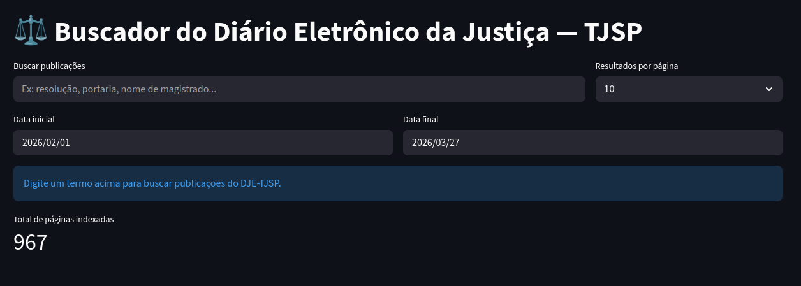

# DJE-TJSP Scraper

Pipeline de coleta, parsing e indexação do Diário Eletrônico da Justiça do Estado de São Paulo (DEJESP), com motor de busca full-text em português.

## Visão geral

Este projeto automatiza a coleta diária do DJE-TJSP e disponibiliza um motor de busca para consulta de publicações por texto livre, tipo de caderno e data.
```
TJSP (DEJESP)
     ↓
  Coletor       → baixa PDFs por data e caderno
     ↓
  Parser        → extrai texto e metadados
     ↓
  Indexador     → indexa no OpenSearch com analyzer PT-BR
     ↓
  Streamlit Dashboard → interface de busca
```

## Stack

- **Python 3.12** — coleta, parsing e indexação
- **pdfplumber** — extração de texto de PDFs nativos
- **Tesseract OCR** — fallback para PDFs escaneados
- **OpenSearch 2.13** — motor de busca com analyzer PT-BR
- **Docker + Docker Compose** — ambiente reproduzível

## Estrutura
```
do-tjsp-scraper/
├── coletor/        # Download dos PDFs do DEJESP
├── parser/         # Extração de texto e metadados
├── indexador/      # Indexação no OpenSearch
├── data/
│   ├── pdfs/       # PDFs baixados
│   └── textos/     # JSONs extraídos
├── pipeline.py     # Orquestração completa
└── docker-compose.yml
```

## Como usar

### 1. Suba a infraestrutura
```bash
docker compose up -d
```

### 2. Rode o pipeline completo
```bash
# Últimos 7 dias (padrão)
python3 pipeline.py

# Número de dias customizado
python3 pipeline.py 30
```

### 3. Acesse o OpenSearch Dashboards
```
http://localhost:5601
```

### 4. Busca via API
```bash
curl -X GET "http://localhost:9200/dje-tjsp/_search?pretty" \
  -H "Content-Type: application/json" \
  -d '{
    "query": {
      "match": {
        "texto": "resolução"
      }
    },
    "highlight": {
      "fields": { "texto": {} }
    }
  }'
```

### 5. Buscador
Interface gráfica de Busca no Streamlit. Esta ferramenta permite explorar publicações do DJE-TJSP através de uma interface intuitiva:
    Busca Full-Text: Consultas rápidas em todo o corpo das publicações.
    Filtros Temporais: Refino de resultados por data inicial e final.
    Destaque de Termos: Visualização imediata do contexto onde a palavra-chave aparece.
    Escalabilidade: Integração com OpenSearch para lidar com grandes volumes de dados indexados.
    <div align="center">
  
</div>


## Campos indexados

| Campo | Tipo | Descrição |
|---|---|---|
| `data` | date | Data de publicação |
| `caderno` | keyword | Caderno do DJE |
| `pagina` | integer | Número da página |
| `texto` | text (PT-BR) | Conteúdo da publicação |

## Fonte dos dados

Diário Eletrônico da Justiça do Estado de São Paulo — [DEJESP](https://www.tjsp.jus.br/atc/dejesp/)
